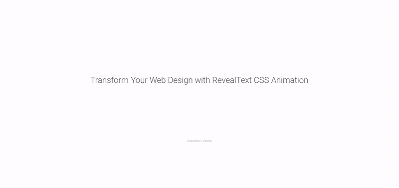
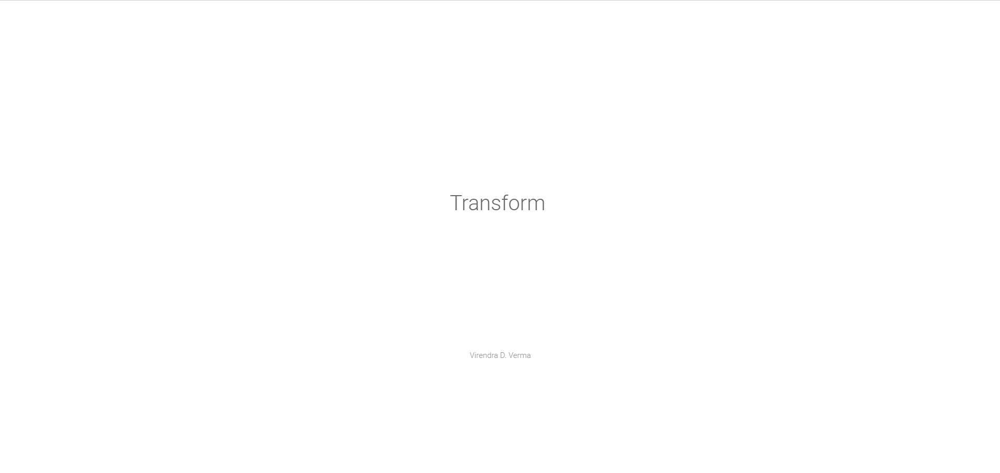
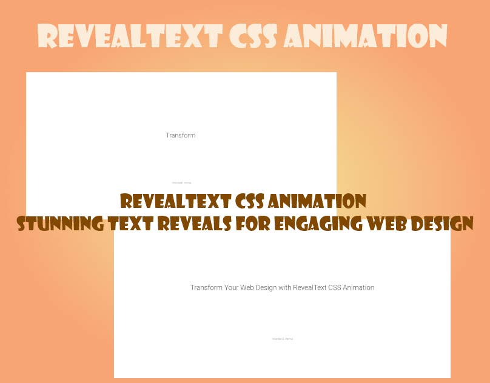

# RevealText CSS Animation – Stunning Text Reveals for Engaging Web Design

<a href="https://www.linkedin.com/in/dharmendraverma95/" target="_blank">LinkedIn Profile </a>

<a href="https://www.behance.net/dhirukumar" target="_blank">Behance Profile </a>

## Overview
Transform your web design with RevealText CSS Animation. This powerful and engaging CSS animation allows you to create stunning text reveals on your website, captivating your users and enhancing their browsing experience. Ideal for headers, paragraphs, or any text element, this animation brings your website to life with smooth, interactive transitions.

### Features
<ul>
  Smooth Text Reveals: Reveal text gradually for an elegant, modern effect.
</li>
  <li>Easy to Implement: Simple CSS classes to apply to your HTML elements.</li>
  <li>Customizable: Easily tweak timing, easing, and effects to fit your design.</li>
  <li>Lightweight: No JavaScript dependencies—pure CSS for a fast and efficient user experience.
</li>
</ul>

# Preview
Desktop Design
 

 
Desktop Design
 

 

 

Cover Design
 

 
###### Lang
<ul>
  <li>Graphic Design Software: Photoshop, Adobe XD (for mockups)</li>
  <li>Web Tools (Optional): HTML5, CSS3 for any digital presentations or landing pages</li>

</ul>

